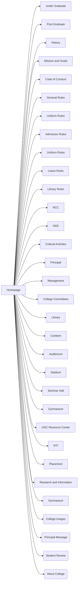

# DFD diagrams

```mermaid

graph LR
A[Homepage] -->B[Under Graduate]
A[Homepage] -->C[Post Graduate]
A[Homepage] -->D[History]
A[Homepage] -->E[Mission and Goals]
A[Homepage] -->F[Code of Conduct]
A[Homepage] -->G[General Rules]
A[Homepage] -->H[Uniform Rules]
A[Homepage] -->I[Admission Rules]
A[Homepage] -->J[Uniform Rules]
A[Homepage] -->K[Leave Rules]
A[Homepage] -->L[Library Rules]
A[Homepage] -->M[NCC]
A[Homepage] -->N[NSS]
A[Homepage] -->O[Cultural Activites]
A[Homepage] -->P[Principal]
A[Homepage] -->Q[Management]
A[Homepage] -->R[College Committees]
A[Homepage] -->S[Library]
A[Homepage] -->T[Canteen]
A[Homepage] -->U[Auditorium]
A[Homepage] -->V[Stadium]
A[Homepage] -->W[Seminar Hall]
A[Homepage] -->X[Gymnasium]
A[Homepage] -->Y[UGC Resource Center]
A[Homepage] -->Z[RTI]
A[Homepage] -->AA[Placement]
A[Homepage] -->AB[Research and Information]
A[Homepage] -->AC[Gymnasium]
A[Homepage] -->A1(College Images)
A[Homepage] -->A2(Principal Message)
A[Homepage] -->A3(Student Review)
A[Homepage] -->A4(About College)
```